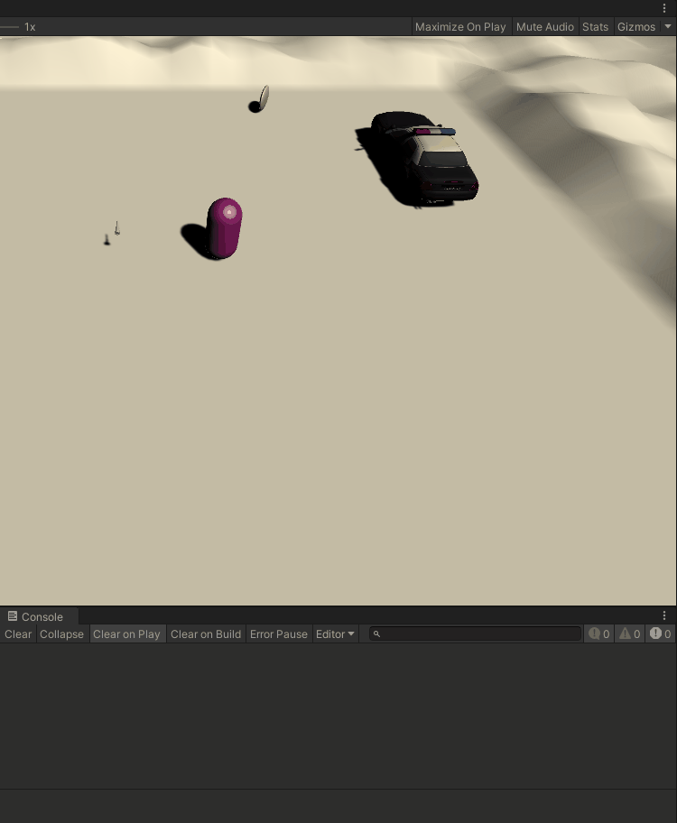
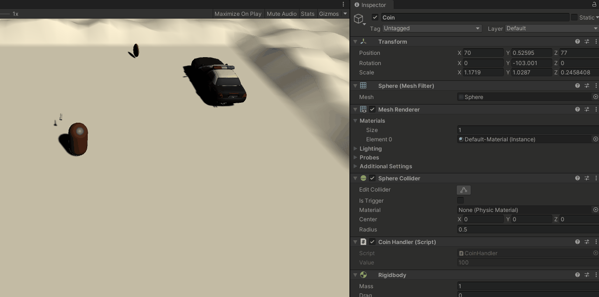
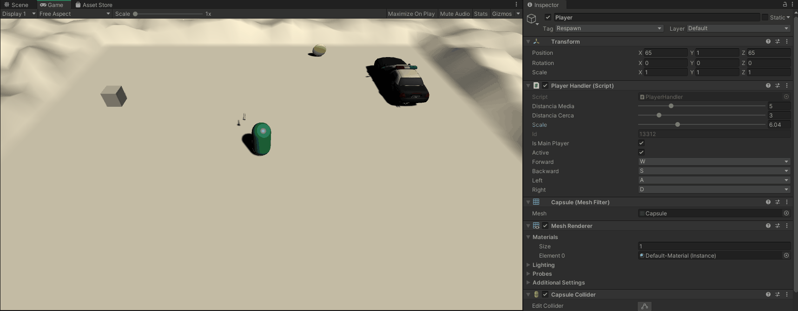
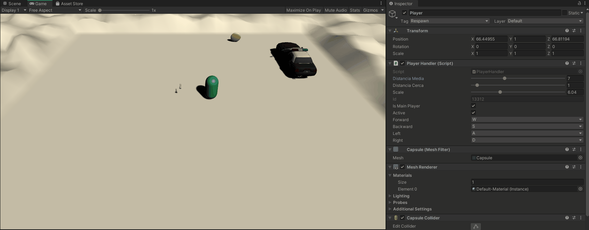
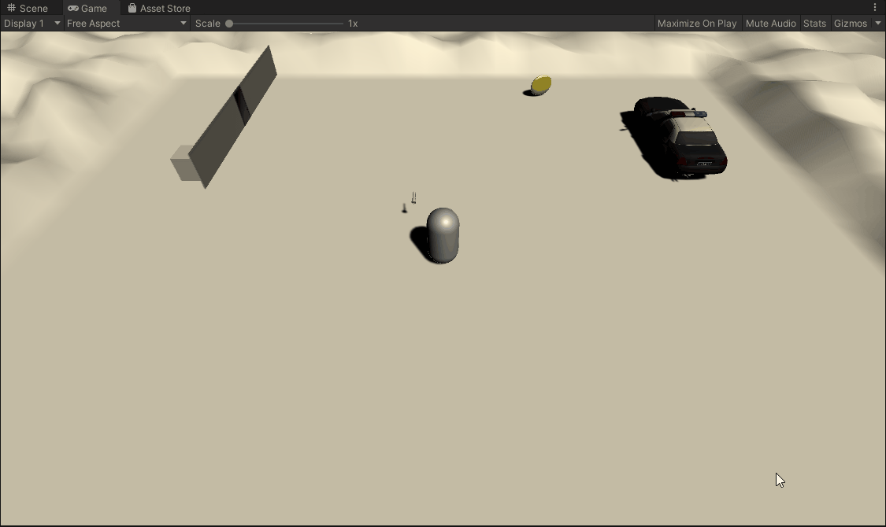
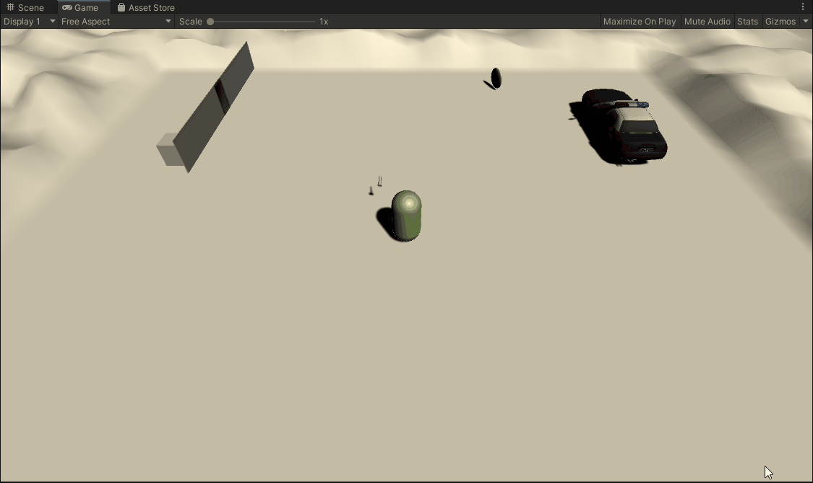

# Practica 3 - Delegados, Eventos
## Javier Duque Melguizo

## Apartado 1
Agregar dos objetos en la escena: A y B. Cuando el jugador colisiona con un objeto de tipo B, el objeto A volcará en consola un mensaje. Cuando toca el objeto A se incrementará un contador en el objeto B.

**Al tocar la moneda, el coche policia suelta un mensaje por consola:**


Esto se consigue con el siguiente codigo:

El codigo del jugador que será el responsable de detectar cuando se choca y disparar el evento "OnPlayerGameObjectCollision" en consecuencia
```c#
public delegate void fOnPlayerGameObjectCollision(PlayerHandler handler, GameObject other); //Importante para definir el tipo de puntero a función que el evento registrará.
public class PlayerHandler : MonoBehaviour
{
	//Todo esto de manejar instancias es para que solo ocurra con una instancia de jugador principal y no una teorica implementación con muchos jugadores
    private static Dictionary<int, PlayerHandler> playerDataBase = new Dictionary<int, PlayerHandler>();
    public static PlayerHandler GetPlayerInstance(int id)
    {
        PlayerHandler player;
        if (PlayerHandler.playerDataBase.TryGetValue(id, out player))
            return player;
        else
            return null;
    }

    private static int mainPlayerId = -1;
    public static int MainPlayerId { get => mainPlayerId; }

    private PlayerHandler() { }
	/// Lo anterior es para tener controlado las posibles instancias del jugador. El codigo responsable de hacer lo que la actividad solicita empieza aqui:
	public event fOnPlayerGameObjectCollision eventOnPlayerGameObjectCollision;
	private void OnTriggerEnter(Collider other)
    {
        eventOnPlayerGameObjectCollision(this,other.gameObject);
    }
}
```

El codigo para que la moneda se "registre" al evento del jugador, lo reciba correctamente y entonces ejecute otro evento ("onCoinCollision") al que estara registrado el coche policia para que diga algo por consola en consecuencia

```c#
public delegate void fOnCoinDestroy(CoinHandler handler);
public class CoinHandler : MonoBehaviour
{
	public static event fOnCoinDestroy eventOnCoinDestroy;
	void Start()
    {
        PlayerHandler.GetPlayerInstance(PlayerHandler.MainPlayerId).eventOnPlayerGameObjectCollision += OnPlayerGameObjectCollision;
    }
	
	 void OnPlayerGameObjectCollision(PlayerHandler handler, GameObject other)
    {
        if (other.GetInstanceID() == this.gameObject.GetInstanceID())
            CoinHandler.eventOnCoinCollision(this); //Disparo otro evento. En este caso para que el objeto tipo B(el coche policia), que estará registrado a él, diga algo cuando la consecuencia "Jugador toca objeto tipo Moneda" ocurra
    }
}
```

Y aqui como el coche policia se registra al evento de la moneda para soltar por consola "¡¡¡Alto policia!!!":

```c#
public class InterceptorHandler : MonoBehaviour
{
	void Start()
    {
        CoinHandler.eventOnCoinCollision += onCoinCollision; //Para que si el jugador choca con la moneda,la moneda dispare el evento y el coche policia al estar registrado recibe esa colisión jugador-moneda
    }
	
	 void onCoinCollision(CoinHandler handler)
    {
        Debug.Log("¡¡¡Alto policia!!!");
    }
```

**Al tocar el coche policia, la moneda decrementa un contador (en este caso, su valor)**


Lo anterior se consigue, añadiendo al codigo anterior, lo siguiente:

Al script que maneja el coche policia se le agrega tambien un evento para que, como el coche policia se registra a un evento de la moneda, la moneda se registre al evento del coche policia y esta pueda detectar cuando se ha producido la colisión jugador-coche policia
```c#
public delegate void fOnInterceptorCollision(InterceptorHandler handler); // NEW
public class InterceptorHandler : MonoBehaviour
{
	void Start()
    {
        CoinHandler.eventOnCoinCollision += onCoinCollision; //Para que si el jugador choca con la moneda,la moneda dispare el evento y el coche policia al estar registrado recibe esa colisión jugador-moneda
		PlayerHandler.GetPlayerInstance(PlayerHandler.MainPlayerId).eventOnPlayerGameObjectCollision += OnPlayerGameObjectCollision; //NEW, para propagar el evento 
    }
	
	 void onCoinCollision(CoinHandler handler)
    {
        Debug.Log("¡¡¡Alto policia!!!");
    }
	
	void OnPlayerGameObjectCollision(PlayerHandler handler, GameObject other) // NEW
    {
        if(other.GetInstanceID() == this.gameObject.GetInstanceID())
            InterceptorHandler.eventOnInterceptorCollision(this); //La moneda recogerá este disparador
    }
```


Aqui el codigo de la moneda para decrecer su propiedad "value"
```c#
public delegate void fOnCoinDestroy(CoinHandler handler);
public class CoinHandler : MonoBehaviour
{
	public static event fOnCoinDestroy eventOnCoinDestroy;
	[ReadOnly] //Atributo custom para que la propiedad se pueda visualizar en el editor de Unity pero no se pueda modificar
    public int value = 100;
	void Start()
    {
        PlayerHandler.GetPlayerInstance(PlayerHandler.MainPlayerId).eventOnPlayerGameObjectCollision += OnPlayerGameObjectCollision;
		InterceptorHandler.eventOnInterceptorCollision += onInterceptorCollision; // NEW. Esencial para detectar cuando se produce la colisión jugador-coche policia
    }
	
	 void OnPlayerGameObjectCollision(PlayerHandler handler, GameObject other)
    {
        if (other.GetInstanceID() == this.gameObject.GetInstanceID())
            CoinHandler.eventOnCoinCollision(this); //Disparo otro evento. En este caso para que el objeto tipo B(el coche policia), que estará registrado a él, diga algo cuando la consecuencia "Jugador toca objeto tipo Moneda" ocurra
    }
	
	void onInterceptorCollision(InterceptorHandler handler) //NEW
    {
        this.value -= 10;
    }
}
```


## Apartado 2

Implementar un controlador de escena usando el patrón delegado que gestione las siguientes acciones:

**Si el jugador dispara, los objetos de tipo A que estén a una distancia media serán desplazados y los que estén a una distancia pequeña serán destruidos. Los umbrales que marcan los límites se deben configurar en el inspector.**


El codigo para lograr lo anterior es el siguiente:
```c#
public class PlayerHandler : MonoBehaviour
{
	[Range(0.0f, 20.0f)]
    public float distanciaMedia = 5.0f;
    [Range(0.0f, 20.0f)]
    public float distanciaCerca = 3.0f;
	
	void FixedUpdate()
    {
        if (Input.GetKey(KeyCode.Space)) //Disparo
        {
            Collider[] colliders = Physics.OverlapSphere(this.transform.position, distanciaCerca);
            foreach (Collider collider in colliders)
                if (collider.attachedRigidbody != null)
                    if (collider.gameObject.GetInstanceID() != TerrainHandler.Instance.gameObject.GetInstanceID())
                        GameObject.Destroy(collider.gameObject);

            colliders = Physics.OverlapSphere(this.transform.position, distanciaMedia);
            foreach (Collider collider in colliders)
                if (collider.attachedRigidbody != null)
                    collider.attachedRigidbody.AddExplosionForce(1.0f, this.transform.position, 10.0f, 3.0f, ForceMode.VelocityChange);
                   
        }

    }
}
```

**Si el jugador choca con objetos de tipo B, todos los de ese tipo sufrirán alguna transformación o algún cambio en su apariencia y decrementarán el poder del jugador.**


El codigo para lo anterior es el siguiente:


En el jugador nos registramos al evento "onInterceptorCollision" del coche policia y decrementamos su poder
```c#
public class PlayerHandler : MonoBehaviour
{
 void onInterceptorCollision(InterceptorHandler handler)
    {
        if(this.distanciaCerca > 10)
            this.distanciaCerca -= 10;
        if (this.distanciaMedia > 10)
            this.distanciaMedia -= 5;
    }
}
```

En el coche policia, en el evento "onPlayerCollision", si el objeto con el que se choca el jugador es el mismo, le aplicamos un cambio de color en el MeshRenderer
```c#
public class InterceptorHandler : MonoBehaviour
{
	void OnPlayerGameObjectCollision(PlayerHandler handler, GameObject other)
    {
        if(other.GetInstanceID() == this.gameObject.GetInstanceID())
        {
            InterceptorHandler.eventOnInterceptorCollision(this);
            Color random = new Color(Random.Range(0.0f, 1.0f), Random.Range(0.0f, 1.0f), Random.Range(0.0f, 1.0f));
            this.GetComponent<MeshRenderer>().material.color = random;
        }
    }
}
```

## Apartado 3 
**En la escena habrá ubicados un tipo de objetos que al ser recolectados por el jugador harán que ciertos obstáculos se desplacen desbloqueando algún espacio.**


<Falta por incluir el codigo>

## Apartado 4
**Incorporar un elemento que sirva para encender o apagar un foco utilizando el teclado.**


<Falta por incluir el codigo>


